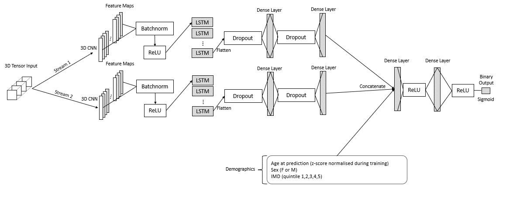

# Sparse TG-CNN

[](https://zenodo.org/doi/10.5281/zenodo.13740953)

### About the Repository

This repository contains the code for a sparse implementation for Temporal Graph-based 3D Convolutional Neural Networks (TG-CNNs) as described in the paper: Developing the Temporal Graph Convolutional Neural Network Model to Predict Hip Replacement using Electronic Health Records. 

We are pleased to announce that this work has been accepted to the [2024 International Conference on Machine Learning and Applications (ICMLA)](https://www.icmla-conference.org/icmla24/index.php), which will be held from December 18-20, 2024 in Miami, Florida.

You can find the pre-print of our paper here: _link will be added when available on ArXiV_. 

Click here to access a PDF of the supplementary material for our paper [here](supplementary_material_developing_the_TGCNN_model_to_predict_hip_replacement_using_EHR.pdf).

In this research we represent graphs as 3D tensors, where the cells contain the elapsed time between two event codes being recorded:


A link to the original paper containing the non-sparse implementation for massive online open course data to predict student dropout can be found [here](https://eprints.whiterose.ac.uk/205293/1/TG-CNNs_for_Online_Course_Dropout_Prediction_03.pdf).

_**Note:** Only fake data are shared in this repository. We randomly choose values to fill our fictitious dataframes. For this reason when this code is run the model will not train well. The data we use for this project is secure ResearchOne data, therefore we can't share it with the public._

### Project Stucture

The code repository structure:

```
.
├── documentation                       # Background, explanations
├── src                                 # Source files
├────> create_fake_patients.py          # Generate fake patient data to use in model
├────> TGCNN_layer.py                   # Sparse 3D CNN layer 
├────> trnvaltst.py                     # Train, validate and test functions for multilabel outcomes
├────> trnvaltst_sigmoid_oned.py        # Train, validate and test functions for binary outcomes
├────> utils.py                         # Helpful functions
├────> plot_figures.py                  # Some more helpful functions for plotting figures
├────> whole_model.py                   # Model with all layers and no demographic input
├────> whole_model_demographics.py      # Model with all layers and demographic input
├── tests                               # Test using pytest
├── .gitignore
├── README.md
├── early_stopping_cv.py                # Checkpointing and stopping the model before it overfits
└── requirements.txt
└── TGCNN_test_fake_patients.ipynb      # Notebook where the main code is ran


```
### Built With 

[](https://www.python.org/downloads/release/python-390/)

- [Tensorflow](https://www.tensorflow.org/)
- [Numpy](https://numpy.org/)
- [Pandas](https://pandas.pydata.org/)

### Getting Started

#### Installation

To clone the repo:

`git clone https://github.com/ZoeHancox/Sparse_TGCNN.git`

To create a suitable environment we suggest:
- Build conda environment via `conda create --name tgcnn_env python=3.9`
- Activate environment `conda activate tgcnn_env`
- Install requirements via `python -m pip install -r ./requirements.txt`

### Usage

Run through the `TGCNN_test_fake_patients.ipynb` notebook to find out how to use this code.

To run the baseline models to compare to the `TGCNN` model, run through the notebooks in `baseline_models/`.

To get the test results pre-calibration and get the logits prepared for recalibration run `results/generate_scores_and_recal_prep.ipynb` and change the `run_name` to the run name you assigned to your model.

To recalibrate the model on Test 1, and test the recalibrated model on Test 2 run the **R** code `recalibration/recalibration_code.R`. Enter the run name of the model. You can choose to do subgroup analysis on your model by entering `y` when prompted by 'Do you want to perform subgroup analysis with this model?'.

### Training the Model

Our implementation utilises a learning rate scheduler, multiplying the learning rate by 0.9 with an exponential decay each 1,000 steps. Early stopping is used with a patience of 5, to checkpoint the model when the validation loss decreases, interrupting execution when the model gets stuck in a local minima.

## Model Architecture




## Ablation Study

| **TGCNN Model** | **$\gamma$** | **Exp** | **Demo** | **2nd stream** | **$\ell_G$** | **$\ell_2$** | **$\ell_1$** | **LSTM** | **Time** | **CNN** |
|-----------------|:------------:|:-------:|:--------:|:-------------------:|:------------:|:------------:|:------------:|:--------:|:--------:|:-------:|
| Full            |   ✔️         |   ✔️    |    ✔️     |         ✔️           |      ✔️       |      ✔️       |      ✔️       |    ✔️    |    ✔️    |    ✔️   |
| w/o gamma       |              |   ✔️    |    ✔️     |         ✔️           |      ✔️       |      ✔️       |      ✔️       |    ✔️    |    ✔️    |    ✔️   |
| w/o exp         |              |         |    ✔️     |         ✔️           |      ✔️       |      ✔️       |      ✔️       |    ✔️    |    ✔️    |    ✔️   |
| w/o elapsed time|   ✔️         |   ✔️    |    ✔️     |         ✔️           |      ✔️       |      ✔️       |      ✔️       |    ✔️    |          |    ✔️   |
| w/o demographics|   ✔️         |   ✔️    |           |         ✔️           |      ✔️       |      ✔️       |      ✔️       |    ✔️    |    ✔️    |    ✔️   |
| w/o two streams |   ✔️         |   ✔️    |    ✔️     |                     |      ✔️       |      ✔️       |      ✔️       |    ✔️    |    ✔️    |    ✔️   |
| w/o $\ell_G$    |   ✔️         |   ✔️    |    ✔️     |         ✔️           |               |      ✔️       |      ✔️       |    ✔️    |    ✔️    |    ✔️   |
| w/o $\ell_2$    |   ✔️         |   ✔️    |    ✔️     |         ✔️           |      ✔️       |               |      ✔️       |    ✔️    |    ✔️    |    ✔️   |
| w/o $\ell_1$    |   ✔️         |   ✔️    |    ✔️     |         ✔️           |      ✔️       |      ✔️       |               |    ✔️    |    ✔️    |    ✔️   |
| w/o LSTM        |   ✔️         |   ✔️    |    ✔️     |         ✔️           |      ✔️       |      ✔️       |      ✔️       |          |    ✔️    |    ✔️   |


Hyperparameter tuning can be performed with the following values randomly chosen:

* Learning rate: 0.001, 0.005, 0.0001
* Number of filters: 8, 16, 32
* Filter size: 3, 4, 6
* Number of LSTM hidden cells: 16, 32, 64, 128, 256
* $\ell_1$ and $\ell_2$ regularisation parameter: 1e-2, 1e-3, 1e-4, 1e-5, 5e-2, 5e-3, 5e-4
* FCL size: 128, 256, 512, 1028, 2056
* Dropout rate: 0.5, 0.6, 0.7, 0.8, 0.9


We randomly searched from these hyperparameters 20 times and selected the hyperparameters from the model with the best validation AUROC to use in our ablation study. The hyperparameters were:

* Learning rate: 0.0001
* Number of filters: 32
* Filter size: 6
* Number of LSTM hidden cells: 128
* $\ell_1$ and $\ell_2$ regularisation parameter: 0.0005
* FCL size: 128
* Dropout rate: 0.6
* Graph $\ell_G$ regularisation strength: 10

We ran these hyperparameters on the ablation models for 12 hours each.

### Testing

To test some of the functions you can run the following from the top directory:
`pytest tests/test_model.py`.

### LICENSE

Unless stated otherwise, the codebase is released under the BSD Licence. This covers both the codebase and any sample code in the documentation.

See [LICENCE](https://github.com/ZoeHancox/Sparse_TGCNN/blob/main/LICENSE.txt) for more information.

### ACKNOWLEDGEMENTS

The TGCNN model was developed using data provided by patients and collected by the NHS as part of their care and support. 

### Referencing

If you make use of this code, please cite this work using this doi:

https://zenodo.org/doi/10.5281/zenodo.13740953

If you reference or make use of the paper, please cite our work using:

_to be added_